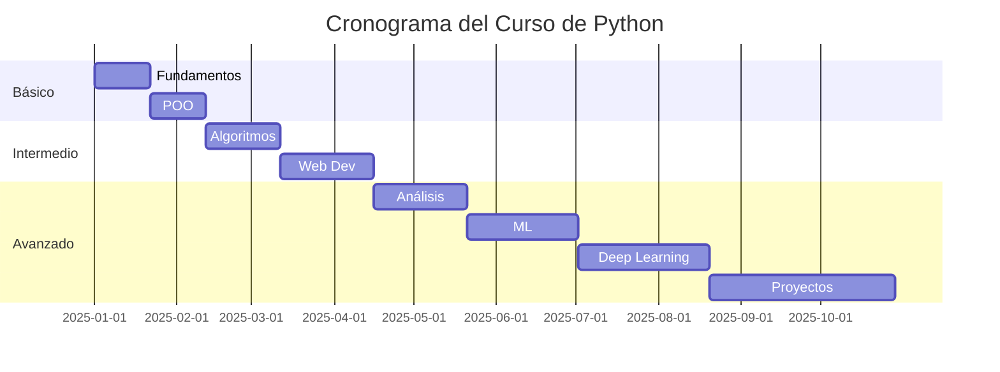

# 🐍 Curso Completo de Python - Modular y Dockerizado

Un curso completo de Python desde fundamentos hasta ciencias de datos, organizado en módulos independientes con ambientes Docker especializados.

## 🎯 Objetivos del Curso

Este curso está diseñado para llevarte desde principiante absoluto hasta desarrollador avanzado en Python, con enfoque especial en:

- **Fundamentos sólidos** de programación
- **Programación Orientada a Objetos** y patrones de diseño
- **Algoritmos y Estructuras de Datos** eficientes
- **Desarrollo Web** con frameworks modernos
- **Análisis de Datos** con herramientas profesionales
- **Machine Learning** y aplicaciones prácticas
- **Deep Learning** y redes neuronales
- **Proyectos reales** y deployment

## 🏗️ Arquitectura Modular

Cada módulo tiene su propio ambiente Docker con las dependencias específicas necesarias:

```
📁 python/
├── 🐳 docker-compose.yml      # Orquestación de todos los módulos
├── 🛠️  manage.sh              # Script de gestión
├── 📊 data/                   # Datasets compartidos
├── 🤖 modelos/                # Modelos de ML/DL
├── 🚀 proyectos/              # Proyectos finales
└── 📚 modulos/
    ├── 01_fundamentos/        # Puerto 8888
    ├── 02_poo/                # Puerto 8889
    ├── 03_algoritmos/         # Puerto 8890
    ├── 04_web/                # Puerto 8891
    ├── 05_analisis_datos/     # Puerto 8892
    ├── 06_machine_learning/   # Puerto 8893
    ├── 07_deep_learning/      # Puerto 8894
    └── 08_proyectos/          # Puerto 8895
```

## 📚 Módulos del Curso

### 🐍 Módulo 1: Fundamentos de Python
**Puerto: 8888** | **Duración: 2-3 semanas**

- Variables y tipos de datos
- Operadores y expresiones  
- Estructuras de control (if, while, for)
- Funciones y módulos
- Manejo de archivos
- Excepciones básicas
- **Proyecto**: Sistema de gestión de biblioteca

**Tecnologías**: Python básico, Jupyter Lab

### 🏗️ Módulo 2: Programación Orientada a Objetos  
**Puerto: 8889** | **Duración: 2-3 semanas**

- Clases y objetos
- Herencia y polimorfismo
- Encapsulación y abstracción
- Métodos especiales (__init__, __str__, etc.)
- Patrones de diseño (Singleton, Factory, Observer)
- **Proyecto**: Sistema de gestión de empleados con jerarquías

**Tecnologías**: Python OOP, UML, Patrones de diseño

### 🧮 Módulo 3: Algoritmos y Estructuras de Datos
**Puerto: 8890** | **Duración: 3-4 semanas**

- Complejidad algorítmica (Big O)
- Listas, pilas, colas
- Árboles y grafos
- Algoritmos de ordenamiento
- Algoritmos de búsqueda
- Programación dinámica
- **Proyecto**: Motor de búsqueda básico

**Tecnologías**: NumPy, NetworkX, visualización de algoritmos

### 🌐 Módulo 4: Desarrollo Web
**Puerto: 8891** | **Duración: 4-5 semanas**

- Flask: APIs REST básicas
- Django: Aplicaciones web completas
- FastAPI: APIs modernas y rápidas
- Bases de datos (SQLite, PostgreSQL)
- Autenticación y autorización
- Testing web
- **Proyecto**: Aplicación web de blog con API REST

**Tecnologías**: Flask, Django, FastAPI, SQLAlchemy, PostgreSQL

### 📊 Módulo 5: Análisis de Datos  
**Puerto: 8892** | **Duración: 4-5 semanas**

- NumPy: Computación numérica
- Pandas: Manipulación de datos
- Matplotlib/Seaborn: Visualización
- Estadística descriptiva
- Limpieza y transformación de datos
- Web scraping
- **Proyecto**: Análisis completo de dataset real

**Tecnologías**: Pandas, NumPy, Matplotlib, Seaborn, Plotly

### 🤖 Módulo 6: Machine Learning
**Puerto: 8893** | **Duración: 5-6 semanas**

- Scikit-learn fundamentals
- Algoritmos supervisados (regresión, clasificación)
- Algoritmos no supervisados (clustering, PCA)
- Validación cruzada y métricas
- Feature engineering
- Ensemble methods
- **Proyecto**: Predictor de precios de viviendas

**Tecnologías**: Scikit-learn, XGBoost, MLflow, Optuna

### 🧠 Módulo 7: Deep Learning
**Puerto: 8894** | **Duración: 6-7 semanas**

- TensorFlow/Keras básico
- PyTorch fundamentals
- Redes neuronales densas
- CNN para imágenes
- RNN/LSTM para secuencias
- Transfer learning
- **Proyecto**: Clasificador de imágenes médicas

**Tecnologías**: TensorFlow, PyTorch, Keras, OpenCV

### 🚀 Módulo 8: Proyectos Avanzados
**Puerto: 8895** | **Duración: 8-10 semanas**

- Integración full-stack
- Microservicios con Python
- Deployment en la nube
- CI/CD pipelines
- Monitoreo y logging
- **Proyecto Final**: Aplicación completa de ML en producción

**Tecnologías**: Docker, Kubernetes, AWS/GCP, GitHub Actions

## 🚀 Instalación y Configuración

### Notas de Versión y Problemas Resueltos

#### Versión Actual (Junio 2025)

- ✅ Módulos 1-4 (Fundamentos, POO, Algoritmos, Web) construidos y probados con éxito
- ✅ Estructura para módulos 5-8 preparada y lista para desarrollo
- ✅ Problemas de dependencias solucionados en el módulo Web:
  - Conflicto entre `pyopenssl` y `cryptography` resuelto usando versión compatible (41.0.7)

#### Problemas Conocidos

- El atributo `version` en docker-compose.yml está obsoleto (genera una advertencia, pero no afecta la funcionalidad)
- Asegúrate de que los puertos requeridos (8888-8895) estén disponibles en tu sistema

### Estado Actual del Proyecto

| Módulo | Estado | Puerto | Docker Image |
|--------|--------|--------|--------------|
| **Fundamentos** | ✅ **ACTIVO** | 8888 | `python-fundamentos` |
| **POO** | ✅ **CONSTRUIDO** | 8889 | `python-poo` |
| **Algoritmos** | ✅ **CONSTRUIDO** | 8890 | `python-algoritmos` |
| **Web** | ✅ **CONSTRUIDO** | 8891 | `python-web` |
| **Análisis** | 🔨 Estructura lista | 8892 | Pendiente build |
| **ML** | 🔨 Estructura lista | 8893 | Pendiente build |
| **DL** | 🔨 Estructura lista | 8894 | Pendiente build |
| **Proyectos** | 🔨 Estructura lista | 8895 | Pendiente build |

### Prerrequisitos

- Docker y Docker Compose instalados
- Git para clonar el repositorio
- Navegador web moderno

### Instalación

Hay tres formas de clonar el repositorio:

#### 1. Usando HTTPS

```bash
# Clonar el repositorio con HTTPS
git clone https://github.com/alexballera/python.git
cd python
```

#### 2. Usando SSH (requiere configuración previa de claves SSH)

```bash
# Clonar el repositorio con SSH
git clone git@github.com:alexballera/python.git
cd python
```

#### 3. Usando GitHub CLI

```bash
# Clonar el repositorio con GitHub CLI
gh repo clone alexballera/python
cd python
```

Una vez clonado el repositorio:

```bash
# Dar permisos de ejecución al script de gestión
chmod +x manage.sh

# Ver ayuda del gestor
./manage.sh help
```

## 📖 Guía de Uso

### Comandos Básicos

```bash
# Listar todos los módulos disponibles
./manage.sh list

# Construir la imagen base (solo necesario la primera vez)
./manage.sh build-base

# Construir un módulo específico
./manage.sh build fundamentos

# Iniciar un módulo
./manage.sh start fundamentos

# Ver estado de todos los módulos
./manage.sh status

# Detener un módulo
./manage.sh stop fundamentos

# Ver logs de un módulo
./manage.sh logs fundamentos
```

### Flujo de Trabajo Recomendado

1. **Construir la imagen base** (solo necesario la primera vez):

   ```bash
   ./manage.sh build-base
   ```

2. **Comenzar con Fundamentos**:

   ```bash
   ./manage.sh build fundamentos
   ./manage.sh start fundamentos
   ```
   
   Accede a: [http://localhost:8888](http://localhost:8888)

3. **Progresión Secuencial**:
   - Completa cada módulo antes de pasar al siguiente
   - Construye el siguiente módulo mientras trabajas en el actual
   - Usa diferentes puertos para tener múltiples módulos activos

4. **Gestión de Recursos**:

   ```bash
   # Detener módulos no utilizados
   ./manage.sh stop fundamentos
   
   # Limpiar recursos del sistema
   ./manage.sh clean
   ```

## 🎓 Metodología de Aprendizaje

### 🚀 Flujo de Trabajo Optimizado

El proyecto ofrece dos formas de trabajo que se complementan:

1. **Usando Docker (Recomendado para ejecución completa)**

   ```bash
   # Construir la imagen base (solo primera vez)
   ./manage.sh build-base
   
   # Construir e iniciar un módulo
   ./manage.sh build fundamentos
   ./manage.sh start fundamentos
   
   # Acceder a Jupyter Lab
   # http://localhost:8888
   ```

2. **Usando Entorno Virtual (Para desarrollo rápido)**

   ```bash
   # Crear y activar entorno virtual
   python -m venv .venv
   source .venv/bin/activate  # Linux/Mac
   
   # Instalar dependencias básicas
   pip install jupyter notebook ipykernel
   
   # Registrar el kernel
   python -m ipykernel install --user --name=python-curso
   ```

Esta combinación da flexibilidad para trabajar con ambientes consistentes (Docker) y hacer desarrollo rápido (entorno local).

### Enfoque Práctico

Cada módulo sigue la metodología **Learn by Doing**:

1. **Teoría Concisa** (20%): Conceptos esenciales
2. **Ejemplos Prácticos** (40%): Código real y funcional  
3. **Ejercicios Guiados** (30%): Práctica supervisada
4. **Proyecto Final** (10%): Aplicación integral

### Evaluación y Progreso

- ✅ **Checkpoints**: Ejercicios de auto-evaluación
- 🎯 **Proyectos**: Aplicaciones prácticas por módulo
- 📊 **Portfolio**: Construcción de un portafolio profesional
- 🏆 **Certificación**: Proyecto final integrador

### Recursos de Apoyo

- 📚 **Documentación**: Notebooks interactivos con teoría
- 🎥 **Ejemplos**: Código comentado paso a paso
- 🔗 **Referencias**: Enlaces a documentación oficial
- 🤝 **Comunidad**: Espacios para resolver dudas

## 🛠️ Tecnologías y Herramientas

### Por Módulo

| Módulo | Tecnologías Principales | Herramientas Adicionales |
|--------|-------------------------|--------------------------|
| **Fundamentos** | Python 3.11, Jupyter Lab | Black, Pytest, Rich |
| **POO** | Python OOP, UML | Sphinx, Pylint, Graphviz |
| **Algoritmos** | NumPy, NetworkX | Memory Profiler, Numba |
| **Web** | Flask, Django, FastAPI | PostgreSQL, Celery, Redis |
| **Análisis** | Pandas, Matplotlib | Plotly, Seaborn, Streamlit |
| **ML** | Scikit-learn, XGBoost | MLflow, Optuna, SHAP |
| **DL** | TensorFlow, PyTorch | Keras, Transformers, OpenCV |
| **Proyectos** | Full Stack | Docker, AWS, GitHub Actions |

### Ambientes Especializados

Cada módulo tiene un **Dockerfile optimizado**:

- **Base apropiada**: Desde `jupyter/base-notebook` hasta `tensorflow-notebook`
- **Dependencias específicas**: Solo lo necesario para cada módulo
- **Configuración automática**: Jupyter Lab listo para usar
- **Puertos dedicados**: Sin conflictos entre módulos

## 📊 Cronograma Sugerido

### Tiempo Total: ~40-50 semanas (8-10 meses)



### Modalidades de Estudio

1. **Intensivo** (6 meses): 20-25 hrs/semana
2. **Regular** (8 meses): 15-20 hrs/semana  
3. **Pausado** (12 meses): 10-15 hrs/semana

## 🎯 Objetivos de Aprendizaje por Nivel

### 🟢 Nivel Básico (Módulos 1-2)

Al completar este nivel serás capaz de:

- Escribir programas Python funcionales
- Aplicar principios de POO
- Debuggear y testing básico
- Trabajar con archivos y APIs simples

### 🟡 Nivel Intermedio (Módulos 3-4)

Al completar este nivel serás capaz de:

- Diseñar algoritmos eficientes
- Crear aplicaciones web completas
- Trabajar con bases de datos
- Implementar APIs REST profesionales

### 🔴 Nivel Avanzado (Módulos 5-8)

Al completar este nivel serás capaz de:

- Analizar y visualizar datos complejos
- Construir modelos de Machine Learning
- Implementar redes neuronales
- Desplegar aplicaciones en producción

## 🏆 Proyectos Destacados

### Portfolio Final

Al completar el curso tendrás un **portfolio profesional** con:

1. **🏪 Sistema de E-commerce** (Web + DB)
2. **📈 Dashboard de Analytics** (Análisis de Datos)  
3. **🤖 Chatbot Inteligente** (NLP + ML)
4. **🎯 Predictor de Mercado** (Time Series + DL)
5. **🌐 API Microservices** (Arquitectura distribuida)

### Tecnologías Aplicadas

- **Frontend**: React, Streamlit, Dash
- **Backend**: Django, FastAPI, Flask
- **Datos**: PostgreSQL, MongoDB, Redis
- **ML/DL**: Scikit-learn, TensorFlow, PyTorch
- **Deployment**: Docker, Kubernetes, AWS
- **CI/CD**: GitHub Actions, Testing automatizado

## 🤝 Contribución y Comunidad

### Cómo Contribuir

1. **Fork** el repositorio
2. **Crea** una rama para tu feature
3. **Desarrolla** mejoras o correcciones
4. **Envía** un Pull Request

### Reportar Issues

- 🐛 **Bugs**: Errores en código o configuración
- 📚 **Documentación**: Mejoras en explicaciones
- 💡 **Features**: Nuevas funcionalidades
- 🎓 **Contenido**: Ejercicios o proyectos adicionales

## 📞 Soporte

### Recursos de Ayuda

- 📖 **Wiki**: Documentación detallada
- 💬 **Discussions**: Preguntas y respuestas
- 🎯 **Issues**: Reportes de problemas
- 📧 **Email**: Contacto directo

### FAQ

**P: ¿Necesito experiencia previa?**  
R: No, el curso está diseñado desde cero.

**P: ¿Puedo saltarme módulos?**  
R: Se recomienda seguir el orden, pero es posible.

**P: ¿Cuánto tiempo necesito diariamente?**  
R: Entre 1-3 horas dependiendo de tu objetivo.

**P: ¿Funcionará en Windows/Mac?**  
R: Sí, Docker es multiplataforma.

## 📜 Licencia

Este proyecto está bajo la Licencia MIT. Ver [LICENSE](LICENSE) para más detalles.

## 🙏 Agradecimientos

- **Jupyter Project**: Por el ecosistema de notebooks
- **Docker**: Por la containerización
- **Python Software Foundation**: Por el lenguaje
- **Open Source Community**: Por las librerías utilizadas

---

**¡Inicia tu journey en Python hoy!** 🚀

```bash
./manage.sh start fundamentos
```

¡Nos vemos en [http://localhost:8888](http://localhost:8888)! 🐍✨

## 🔧 Notas Técnicas

### Resolución de Problemas de Dependencias

Algunos módulos pueden presentar conflictos de dependencias debido a las diferentes versiones de las bibliotecas requeridas. Un caso destacado fue en el módulo Web:

**Problema:** Conflicto entre `pyopenssl` (que requiere `cryptography<42`) y la versión más reciente de `cryptography` (43.0.3).

**Solución aplicada:**

```bash
# En modulos/04_web/requirements.txt
cryptography==41.0.7  # Versión compatible con pyopenssl
```

Este tipo de ajustes puede ser necesario en otros módulos a medida que evolucionen las dependencias. El enfoque modular del proyecto ayuda a aislar estos problemas para que no afecten todo el curso.

### Optimización de Imágenes Docker

Los Dockerfiles están optimizados para:

- Minimizar el tamaño de las imágenes
- Acelerar el tiempo de construcción
- Proporcionar todas las dependencias necesarias sin redundancias

## 🔄 Próximos Pasos

### Desarrollo Continuo

El proyecto está en desarrollo activo con las siguientes prioridades:

1. **Completar contenido de los módulos construidos**:
   - Desarrollar notebooks adicionales para POO, Algoritmos y Web
   - Implementar proyectos prácticos para cada módulo

2. **Construir y probar los módulos restantes**:
   - Análisis de Datos (Módulo 5)
   - Machine Learning (Módulo 6)
   - Deep Learning (Módulo 7)
   - Proyectos Avanzados (Módulo 8)

3. **Mejoras de infraestructura implementadas**:
   - ✅ Dockerfiles optimizados con imagen base compartida para reducir tamaño (~30%) y mejorar mantenibilidad
   - ✅ Script de gestión mejorado con validaciones adicionales y mejor manejo de errores
   - ✅ Flujo de trabajo dual: Docker para ejecución completa y entorno virtual local para desarrollo rápido
   - ✅ Usuario no-root en contenedores para mayor seguridad
   - 🔄 En progreso: Implementación de monitorización de recursos y métricas de rendimiento

### Contribuciones Bienvenidas

Se agradecen contribuciones en las siguientes áreas:

- Contenido educativo adicional
- Correcciones de errores
- Mejoras en la documentación
- Optimizaciones de infraestructura
